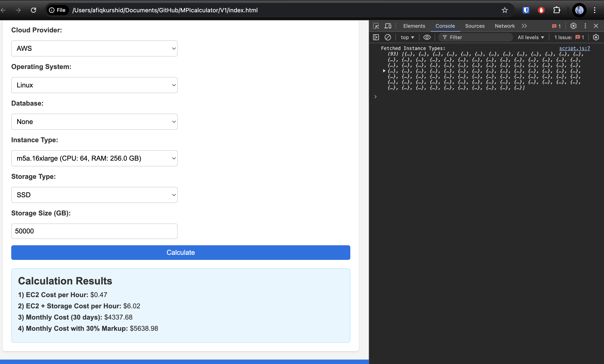
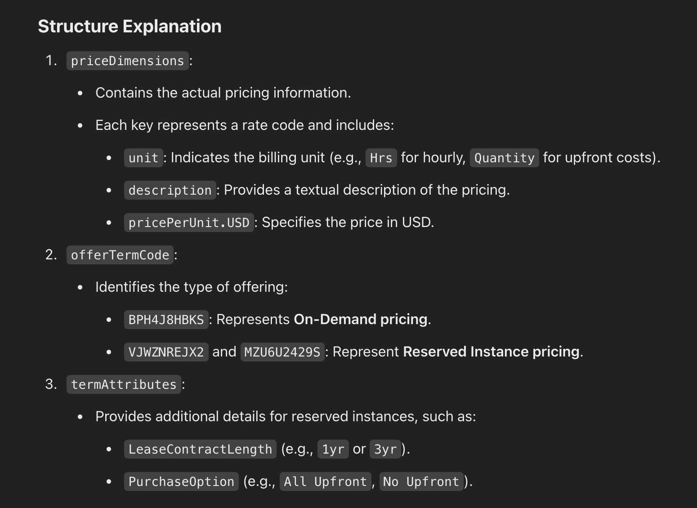
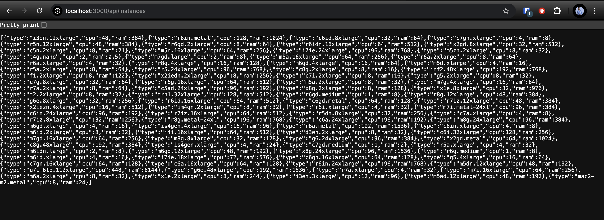
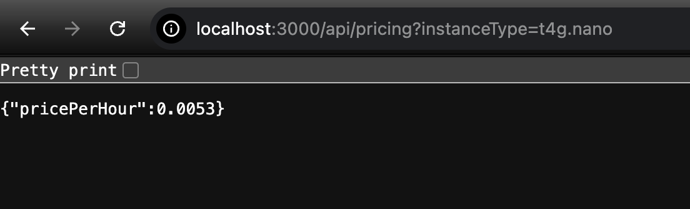
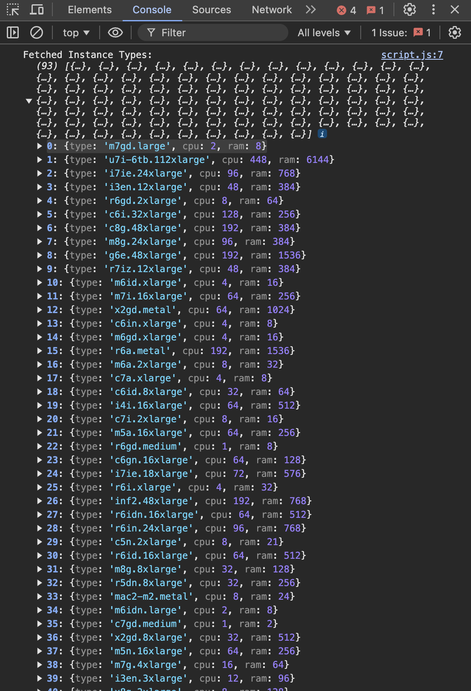
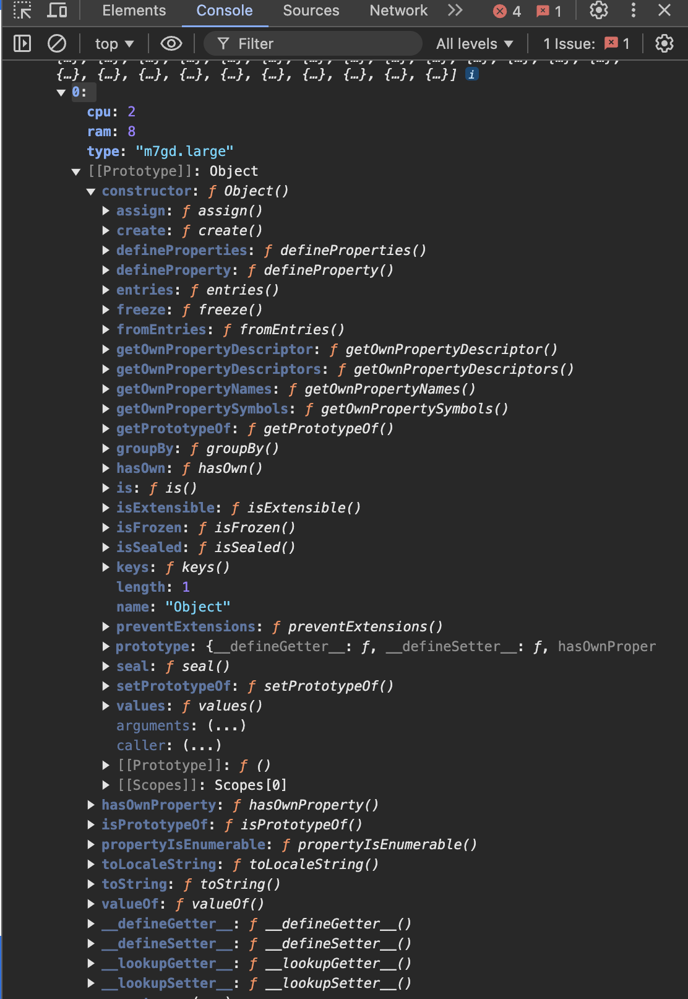
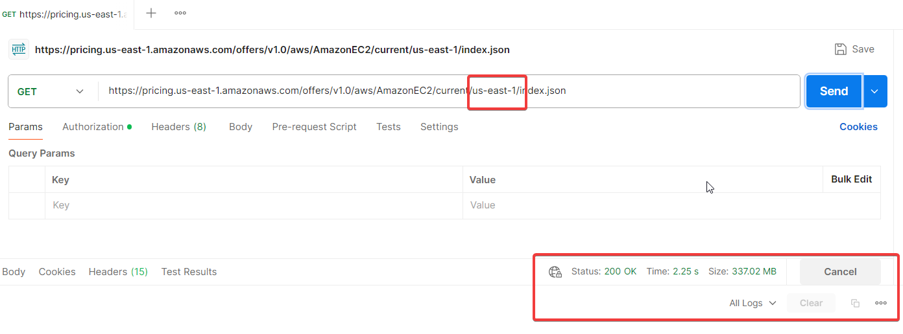

## Step to run nodejs server
Go to terminal open directory ```/Users/afiqkurshid/Documents/GitHub/MPIcalculator/V1``` 

Run command ```node app.js``` - make sure already in folder
Ensure the server is running at http://localhost:3000:
Output: ```Server running on http://localhost:3000```


Homepage link
```http://localhost:3000/```

# Expected Output

After selecting the instance type, storage size, and clicking "Calculate," the estimated cost will be displayed.

## Example Output


### Project Structure


### After add 
EC2 hourly cost.
EC2 + storage hourly cost.
Monthly cost for 30 days.
Monthly cost with a 30% markup.



### only works




```http://localhost:3000/api/instances``` - address to check if instant call are success



```http://localhost:3000/api/pricing?instanceType=t4g.nano``` - address to check t4g.nano hourly rate



### Type of data API call

I will need to do data cleansing






### How big the data is?



### Can we filter this out?
NO!! The AWS pricing API does not support filtering the response by instance type using a query parameter in the URL
-------------------------------

## As of now (16 Jan 2025)
1) Manage to call Instant type
2) Manage to call only t4g.nano & t4g.micro for hourly rate
3) However in main page it cant calculate yet

-----------------------------------

Call using AWS CLI

aws pricing get-products \
    --service-code AmazonEC2 \
    --filters 'Type=TERM_MATCH,Field=instanceType,Value=t2.micro' \
              'Type=TERM_MATCH,Field=operatingSystem,Value=Linux' \
              'Type=TERM_MATCH,Field=location,Value=US East (N. Virginia)' \
              'Type=TERM_MATCH,Field=termType,Value=OnDemand' \
    --query "PriceList[0].terms.OnDemand.*.priceDimensions.*.pricePerUnit.USD" \
    --output text


= but output is too many
same issue, unable to querry
