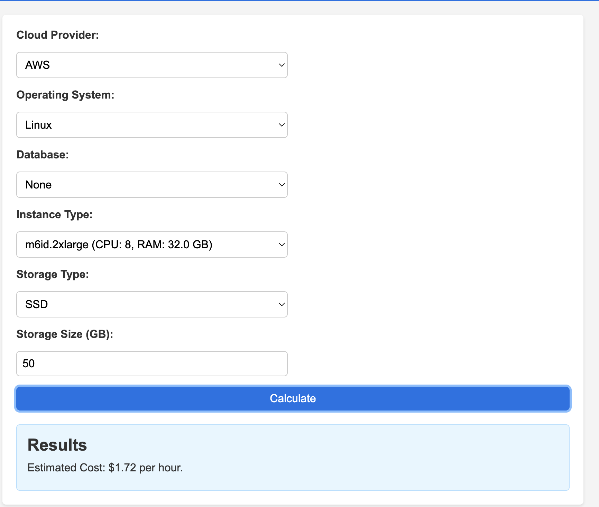
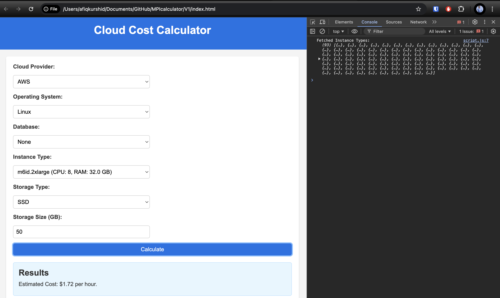

Open directory ```V1/index.html``` this is my case


Go to terminal ```node app.js``` - make sure already in folder
Ensure the server is running at http://localhost:3000:
Server running on http://localhost:3000


Open the provided URL (e.g., http://127.0.0.1:8080) in your browser.

Access the Backend API

To fetch instance types directly from the backend, visit:

```http://localhost:3000/api/instances```
@
```file:///Users/afiqkurshid/Documents/GitHub/MPIcalculator/V1/index.html```

Expected Output

After selecting the instance type, storage size, and clicking "Calculate," the estimated cost will be displayed.

Example Output


Project Structure




